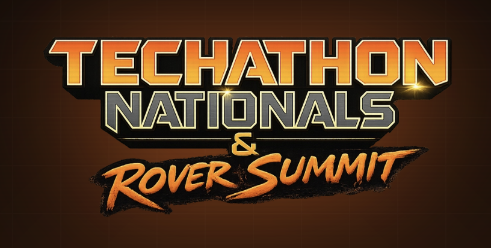
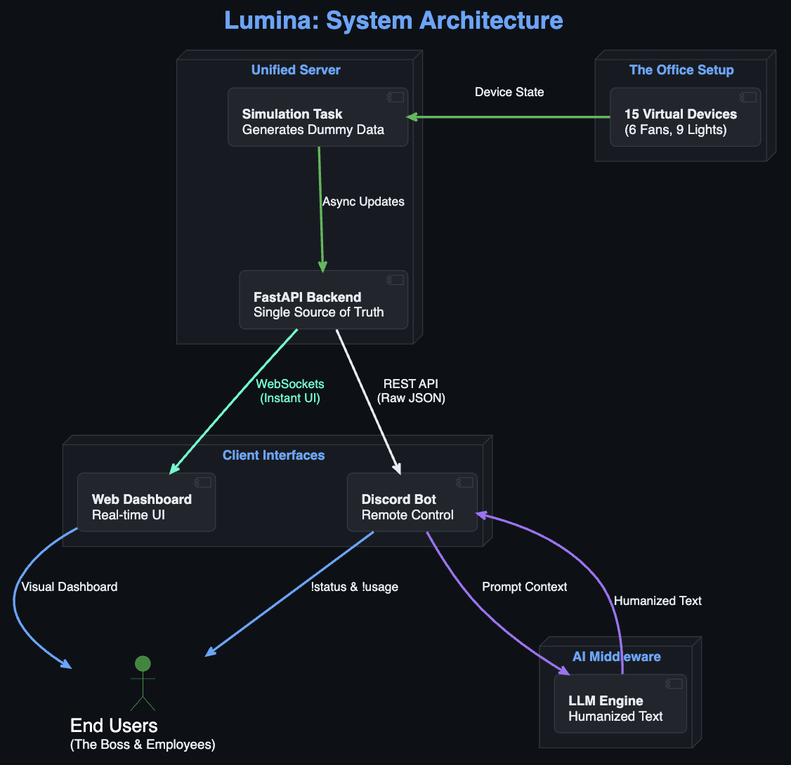

<p align="center">
  
</p>

<p align="center">
  
</p>

# 🎯 ULAB_Anonymous_3.0: Lumina IoT Workspace Orchestrator

Lumina is a production-ready **Digital Twin & IoT Observability Ecosystem** designed to tackle energy waste in modern workspaces. Built on an event-driven, single-source-of-truth backend, it unifies a real-time web dashboard, an LLM-powered Discord automation agent, and a simulated physical hardware schematic.

---

## 1. Problem Understanding & Relevance
In many office spaces, electrical appliances (lights, fans) are frequently left running after hours, resulting in skyrocketing electricity bills and safety concerns. The boss's big idea is to establish:
1. ** observability**: A live visual dashboard representing the entire office's device states (lights, fans) and live power consumption.
2. **Alerts**: Instant notifications when devices are left active inappropriately.
3. **Conversational interface**: A Discord bot that answers queries about the office's energy states in friendly, humanized terms rather than dumping robotic logs.

---

## 2. Architecture & Data Flow

To prevent discrepancies, the system employs a **Unified Single Source of Truth** architecture:



### Architectural Highlights
- **Sub-Second Latency**: State changes in the backend are immediately propagated to the web client using WebSockets, avoiding client-side polling.
- **Data Parity**: The Discord bot and Web UI query the exact same backend state manager endpoints, ensuring they never present conflicting realities.
- **Non-Blocking I/O**: Python's `asyncio` is used extensively to run the telemetry daemon, API requests, WebSocket broadcasts, and Discord bot tasks concurrently without thread starvation.

---

## 3. Technology Stack
- **Backend API**: Python 3.11+, FastAPI, Uvicorn, Asyncio.
- **Frontend Dashboard**: Vanilla HTML5, CSS Custom Animations, Tailwind CSS, Native WebSockets.
- **Discord Bot**: `discord.py`, `aiohttp` for async queries.
- **Local AI Engine**: Ollama running a 4-bit quantized `qwen2.5-coder:3b` model (offline, private inference).
- **Hardware Integration**: Arduino Uno, LEDs, Relays, and Servos.

---

## 4. Hardware Circuit Schematic

Below is the representative circuit schematic showing how the devices (3 Lights and 2 Fans) are wired to the Arduino Uno microcontroller for a single office zone (Drawing Room):


*(The raw configuration is saved in [hardware/diagram.json](file:///Users/a/code/Techathon2026-ULAB_Anonymous_3.0/hardware/diagram.json) and the firmware sketch is in [hardware/sketch.ino](file:///Users/a/code/Techathon2026-ULAB_Anonymous_3.0/hardware/sketch.ino))*

---

## 5. Setup & Running Instructions

### Prerequisites (All Platforms)
1. **Python 3.11+** installed (Verify with `python --version` or `python3 --version`).
2. **Ollama** installed and active. Pull the Qwen model locally:
   ```bash
   ollama run qwen2.5-coder:3b
   ```

---

### 💻 macOS & Linux Setup Guide

#### **Method A: Quick Start (One-Command Launcher)**
Initialize the virtual environment, install libraries, load environment files, and start the servers concurrently:
```bash
# 1. Give executable permissions to the shell script
chmod +x start.sh

# 2. Run the launcher
./start.sh
```

#### **Method B: Manual Step-by-Step Launch**
1. **Virtual Environment & Dependencies**:
   ```bash
   python3 -m venv venv
   source venv/bin/activate
   pip install -r backend/requirements.txt
   ```
2. **Environment Configuration**:
   ```bash
   cp backend/.env.example backend/.env
   # Open backend/.env and populate DISCORD_BOT_TOKEN and DISCORD_CHANNEL_ID
   ```
3. **Run Services (in separate terminal tabs)**:
   - **Start Backend API**: `python3 backend/main.py` (Runs at `http://localhost:8000`)
   - **Start Discord Bot**: `python3 backend/bot.py`

---

### 🪟 Windows Setup Guide (Command Prompt / PowerShell)

#### **Method A: Quick Start (One-Click Launcher)**
1. Copy `backend/.env.example` to `backend/.env` and configure your Discord details.
2. Double-click the **`start.bat`** file in the project root folder. It will configure the virtual environment and launch both the backend API and Discord Bot in separate labeled Command Prompt windows automatically!

#### **Method B: Manual Step-by-Step Launch**
1. **Virtual Environment & Dependencies**:
   Open Command Prompt (`cmd`) or PowerShell in the project root:
   ```cmd
   python -m venv venv
   call venv\Scripts\activate
   pip install -r backend/requirements.txt
   ```
2. **Environment Configuration**:
   ```cmd
   copy backend\.env.example backend\.env
   :: Open backend\.env and configure DISCORD_BOT_TOKEN and DISCORD_CHANNEL_ID
   ```
3. **Run Services (in separate terminal windows)**:
   - **Start Backend API**: 
     ```cmd
     call venv\Scripts\activate
     python backend/main.py
     ```
   - **Start Discord Bot**: 
     ```cmd
     call venv\Scripts\activate
     python backend/bot.py
     ```

---

### 🌐 Viewing the Live Dashboard
Once the backend is running, open your web browser and navigate directly to:
👉 **`http://localhost:8000`** (or open `frontend/index.html` locally).

---

## 6. API Endpoint Documentation

| Method | Endpoint | Description |
|---|---|---|
| **GET** | `/api/devices` | Retrieves the states of all 15 IoT devices (Drawing Room, Work Rooms). |
| **POST** | `/api/devices/{device_id}/toggle` | Toggles the ON/OFF state of a device and broadcasts it via WebSockets. |
| **GET** | `/api/usage` | Calculates total live wattage, per-zone breakdown, and daily usage (kWh). |
| **GET** | `/api/alerts` | Checks and returns active warning or critical anomalies. |
| **POST** | `/api/admin/override-time` | Overrides the virtual office clock (0-23) to test after-hours alerts. |
| **POST** | `/api/admin/reset-time` | Resets the virtual clock to match local system time. |
| **POST** | `/api/admin/simulate-anomaly` | Forces all devices in a room ON and offsets timestamps to trigger 2h warnings. |

---

## 7. AI Integration & Anonymized Reports
- **Local LLM**: Utilizes `qwen2.5-coder:3b` (Quantized Q4_K_M) via Ollama.
- **Anonymization & Constraints**: The prompt engineering parameters strictly enforce anonymity rules. The AI translates raw JSON logs into conversational alerts while completely avoiding employee names (such as Nafisa or Tanvir) or administrative roles to prevent security leakage.
- **Proactive Warnings**: A background listener queries `/api/alerts` periodically. If a warning (after-hours usage) or critical alert (extreme off-hours load) is active, the bot generates a friendly, high-urgency message block containing warning indicators (e.g. 🚨, 🔥) and posts it to the configured channel.


---

## 8. Discord Commands & Administrative Security

The Discord Bot client responds to prefix commands (`!`) and supports secure administrative commands:

- **`!status`**: Displays a humanized conversational report of the active devices across the three rooms.
- **`!room <room_name>`**: Fetches the active appliance count and status for a specific target room.
- **`!usage`**: Summarizes the office load in Watts, actual daily accumulated energy (kWh), and the projected 24-hour cycle estimation.
- **`!shutdown`**: *(Admin Only)* Triggers a remote bulk command to instantly turn off all 15 active lights and fans. This command is restricted using `@commands.has_permissions(administrator=True)`. Attempting execution without admin permissions outputs: `❌ Access Denied: You do not have the required permissions to execute this command.`

---

## 9. Setup & Using the Discord Bot (Step-by-Step Guide)

> [!IMPORTANT]
> **🚀 Instant Demo Setup (Skip Discord Developer Portal)**
> To make it as easy as possible for judges to evaluate the project, we have pre-configured a **Lumina Demonstration Bot**. You do not need to register a bot or copy any tokens!
> 
> **How to test it in 3 steps:**
> 1. Click this link to invite our pre-configured bot to your server:
>    👉 **[Click Here to Invite the Lumina Demo Bot](https://discord.com/api/oauth2/authorize?client_id=1522588266770206770&permissions=3072&scope=bot)**
> 2. Boot up the local project using `start.bat` (Windows) or `./start.sh` (Mac) — the bot script will automatically fall back to this shared token.
> 3. Go to any channel in your Discord server and type **`!setchannel`**. The bot will dynamically bind and start posting live alerts and responding to commands there!

---

To configure, connect, and interact with your own custom Discord agent, follow these steps:

### **Step A: Register Your Bot Application**
1. Open the **[Discord Developer Portal](https://discord.com/developers/applications)** and click **New Application**.
2. Go to the **Bot** tab on the left sidebar:
   - Click **Add Bot** and confirm.
   - Under **Privileged Gateway Intents**, enable **Message Content Intent** (This allows the bot to read prefix commands like `!status`).
   - Click **Reset Token** and copy the generated secret key. Paste this key into `backend/.env` as the `DISCORD_BOT_TOKEN`.

### **Step B: Invite the Bot to Your Server**
1. Go to the **OAuth2** tab on the left sidebar, then click **URL Generator**.
2. Select the **`bot`** scope.
3. Select these **Bot Permissions**:
   - `Send Messages`
   - `Embed Links`
   - `Read Message History`
4. Copy the generated URL at the bottom of the page, open it in a browser, and choose the Discord server you want to invite the bot to.

### **Step C: Get Your Channel ID**
1. In Discord, open **User Settings** -> **Advanced**, and toggle **Developer Mode** ON.
2. Right-click the channel where you want the bot to post warnings and accept commands, and click **Copy Channel ID**.
3. Paste this value into `backend/.env` as the `DISCORD_CHANNEL_ID`.

### **Step D: Interact in Discord**
Once the bot is started (via `start.bat` or `start.sh`):
- **Observe Active Devices**: Type `!status` in your channel. The bot will query the FastAPI state manager and respond with a friendly report (e.g. *"Drawing Room: 1 fan ON. Work Room 1: all off. Work Room 2: 2 lights ON"*).
- **Check Specific Rooms**: Type `!room Work Room 2` to fetch device details for a single room.
- **Get Consumption Metrics**: Type `!usage` to get the live office load and accumulated/projected daily kWh consumption.
- **Emergency Shutdown**: Type `!shutdown` as a server administrator. The bot will send a bulk shutdown command to the backend to turn off all active devices.
- **Automatic Off-Hours Alerts**: Turn ON 3 or more devices in the dashboard and set the time slider to after-hours (e.g., 9:00 PM). The bot will automatically push a high-urgency warning card (🚨 / 🔥) to the channel!

---

## 10. Hackathon Project Metadata
- **Team Name**: `ULAB_Anonymous_3.0`
- **Team Lead**: `Only Ovi`
- **Institution**: University of Liberal Arts Bangladesh (ULAB)
