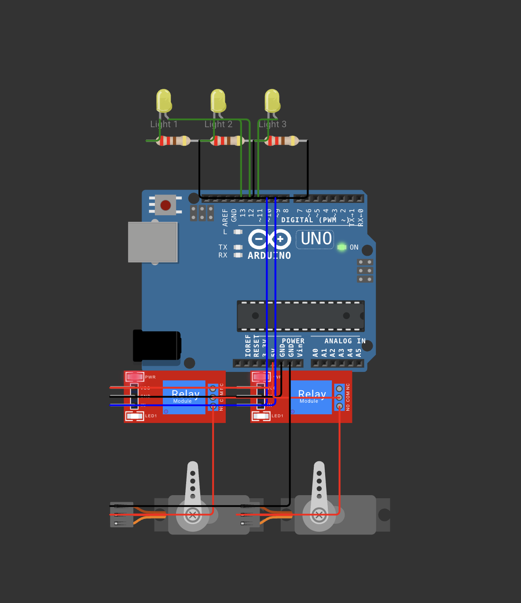

# 🔌 Lumina Hardware Integration: Arduino Uno Representative Schematic

This folder contains the complete wiring guide, pin mapping, firmware code, and visual schematic diagram representing a single office zone (e.g., Drawing Room) configured with **3 Lights** and **2 Fans** wired to an **Arduino Uno**.

---

## 📷 Circuit Schematic Diagram

Below is the visual schematic diagram of the simulated hardware twin rendered in Wokwi:

---

## 1. Component Specification (Single Room: 2 Fans, 3 Lights)

To represent a single room's IoT assets, we use the following hardware components:
- **1x Arduino Uno R3** Microcontroller
- **3x LEDs (Yellow)** - Representing Illumination (Lights 1, 2, 3)
- **3x 220Ω Current-Limiting Resistors** - Protects LEDs from overcurrent from Arduino pins
- **2x 5V Relay Modules** - Controls power to the Fan actuators (Fans 1, 2)
- **2x Servos** - Actuating motors representing the ceiling fans

---

## 2. Pin-Mapping Table

| Arduino Uno Pin | Physical Component | Signal Type | Electrical Specification | Description |
|---|---|---|---|---|
| **Pin 13** | Light 1 LED | Digital Output | 5V Logic -> 220Ω -> LED | Drives Light 1 indicator |
| **Pin 12** | Light 2 LED | Digital Output | 5V Logic -> 220Ω -> LED | Drives Light 2 indicator |
| **Pin 11** | Light 3 LED | Digital Output | 5V Logic -> 220Ω -> LED | Drives Light 3 indicator |
| **Pin 10** | Relay 1 (Fan 1 Control) | Digital Output | 5V Logic -> Relay IN | Toggles Fan 1 power relay (COM to 5V, NO to Servo V+) |
| **Pin 9** | Relay 2 (Fan 2 Control) | Digital Output | 5V Logic -> Relay IN | Toggles Fan 2 power relay (COM to 5V, NO to Servo V+) |
| **5V** | Relay VCC, Relay COM | Power | 5V Power Line | Supply voltage for relays and servo actuators |
| **GND** | LEDs, Relays, and Servos GND | Ground | Reference Ground | Common reference ground for all modules |

---

## 3. Connection & Wiring Guide

Follow this step-by-step wiring guide to assemble the circuit:

### A. LEDs (Illumination Simulation)
1. Place **Light 1 LED**, **Light 2 LED**, and **Light 3 LED** on the breadboard.
2. Connect the **Cathode (shorter leg)** of each LED through a `220Ω resistor` to the Arduino **GND** terminal.
3. Connect the **Anode (longer leg)** of **Light 1** to Arduino **Pin 13**.
4. Connect the **Anode (longer leg)** of **Light 2** to Arduino **Pin 12**.
5. Connect the **Anode (longer leg)** of **Light 3** to Arduino **Pin 11**.

### B. Relays (HVAC Fan Control)
1. Connect Arduino **5V** to the Relay Modules' **VCC** and **COM** pins.
2. Connect Arduino **GND** pins to the Relay Modules' **GND** pins.
3. Connect Arduino **Pin 10** to Relay 1 **IN**.
4. Connect Arduino **Pin 9** to Relay 2 **IN**.
5. Connect Relay 1 **Normally Open (NO)** contact to **Fan 1 (Servo V+)** power wire.
6. Connect Relay 2 **Normally Open (NO)** contact to **Fan 2 (Servo V+)** power wire.
7. Connect the **GND** wires of both Servos to the Arduino **GND** rail.
